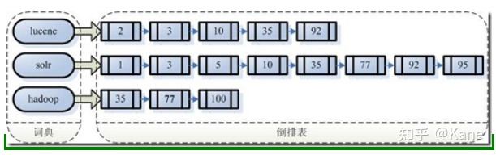
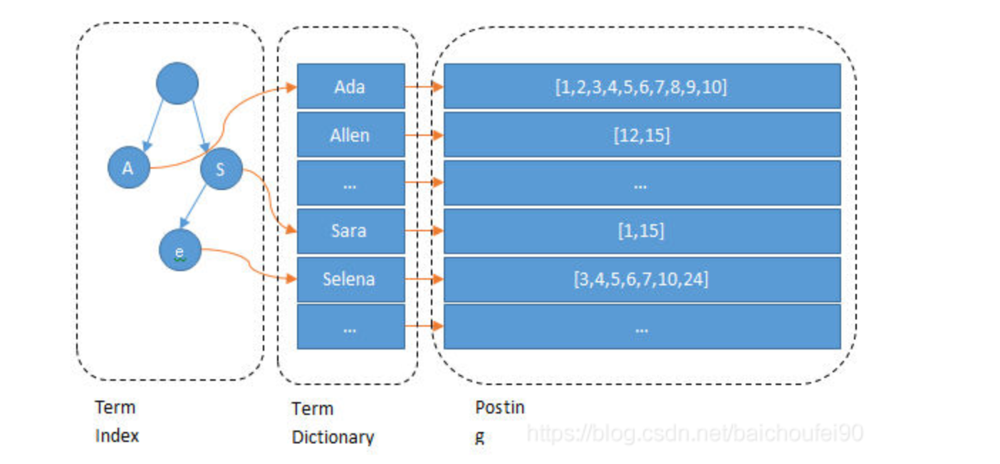
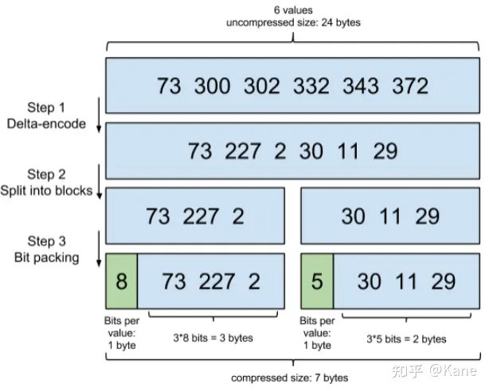
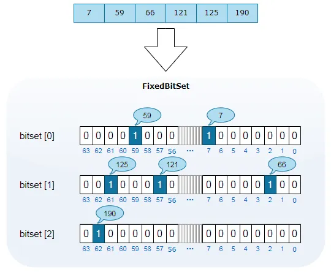
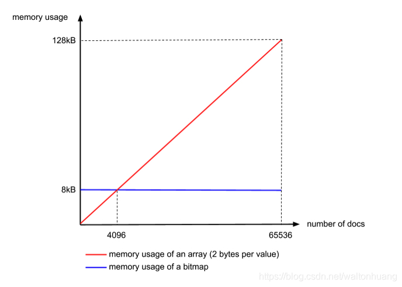
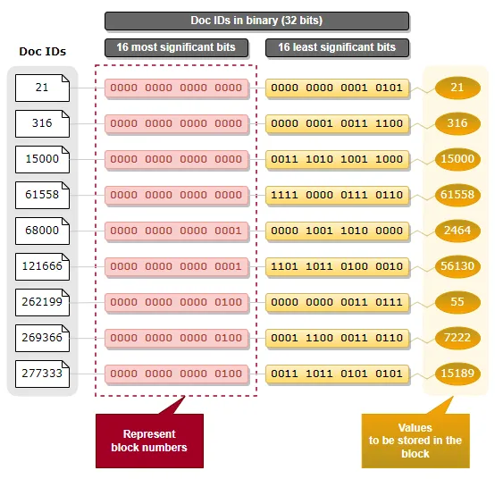
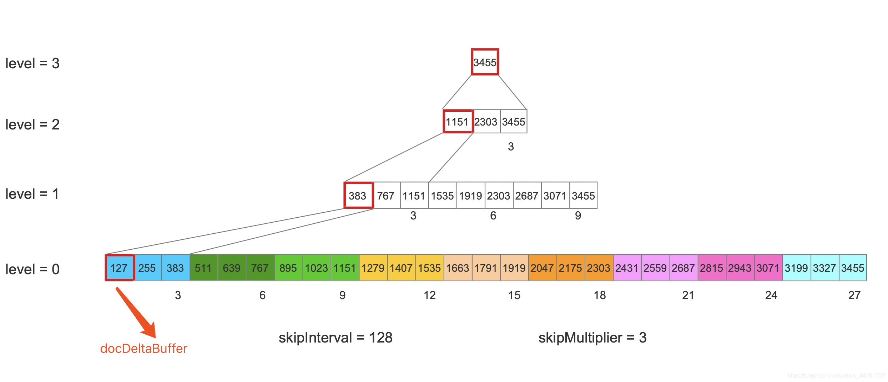

# but how do it know - 全文索引所背后的的技术

## 引言

全文检索功能大家都使用过，如ElasticSearch、Solr、PG TextSearch等。这些开箱机即用的工具提供了强大的文本检索功能。但如果不了解背后的原理、技术，在使用时就可能会纰漏不断。

- pic es
- pic solr


我们将以lucene为例，探讨下他的索引结构、查找方式


## 问题1

如果我们索引 ```Lucene is a full-text search library。``` 这句话。当我们搜索 fulltext时能否检索到。


## 问题二
当有新文档加入索引后，倒排表的数据变化会导致占用磁盘空间发生变化。此时会不会在磁盘上动态调整已有的倒排表数据位置以进行扩容?

-- last frozen node 


## Lucene怎么处理要索引的数据

文档(document)： term的原始集合，检索的基本单位
词(term): 索引的最小单位，是经过词法分词和语言处理后的字符串

- pic 文档、词的关系
- pic 分词 \ 小写转化\ 单数


### 字典

每个词都指向包含此字符串的文档(Document)链表，此文档链表称为倒排表(Posting List)。




<提问>看到倒排表，大家第一个想到的对应数据结构是什么？

hash

### fst
fst(Finite State Transducer)



FST压缩率一般在3倍~20倍之间，相对于TreeMap/HashMap的膨胀3倍，内存节省就有9倍到60倍。


### posting list压缩

term的文档特别多时int数组占用的空间也不容小觑，为了减少空间占用，需要对posting list进行压缩

#### 增量编码压缩（Frame Of Reference）
大数转为小数，第一个记录完整数，后续的记录与他的差值
这样int转short就能记录



### 位图压缩(RoaringDocIdSet)(Roaring bitmaps)
使用1个bit位表示其代表的数是否在数组中，一般对id取除数得到行数，余数对应其行内位置。


内存占用是固定的，因为每个block的大小是65536(2^16)，如果是bitmap的话，需要65536/8 byte=8192 byte（不论实际的文档数有多少都需要这么多） 而如果是用Integer array的话，则真正包含的文档数越多的话，需要的内存越大，是一个线性增长的过程。 那么看看下面的图，我们就可以得出这个阈值就是 8192byte / 2byte = 4096（个）文档。也就是说，当文档数少于4096的时候，用Integer array划算，否则用bitmap划算。




Lucene 中的LRU 查询缓存对密度小于 1% 的集合使用RoaringDocIdSet 。否则，使用FixedBitSet 。
## 跳表

为了能够快速查找 docid 对应的 document，lucene 采用了SkipList 这一数据结构。SkipList 有以下几个特征：

- skipInterval：该值描述了在 level=0 层，每处理 N 篇 document 文档，就生成一个 skipDatum，该值默认为 128。
- skipMultiplier：该值描述了所有层，每处理 N 个skipDatum，就在上一层生成一个新的 skipDatum，该值默认为 8
- numberOfSkipLevels：skipList中的层数


## 磁盘中的索引数据


## 问题解答
